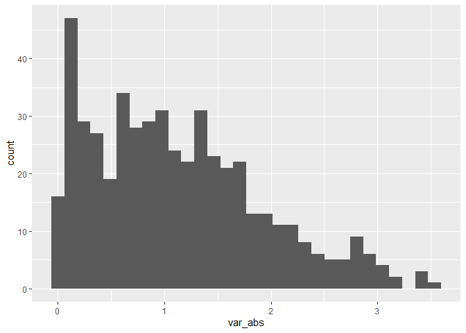

Simple document
================
Jiayi
2022-9-18

``` r
library(tidyverse)
```

I’m an R Markdown document!

*italic* or *italic* **bold** or **bold** `code` superscript<sup>2</sup>
and subscript<sub>2</sub>

# 1st Level Header

## 2nd Level Header

### 3rd Level Header

## Lists

-   Bulleted list item 1

-   Item 2

    -   Item 2a

    -   Item 2b

1.  Numbered list item 1

2.  Item 2. The numbers are incremented automatically in the output.

## Tables

| First Header | Second Header | Third Header |
|--------------|---------------|--------------|
| Content Cell | Content Cell  | Content Cell |
| Content Cell | Content Cell  | Content Cell |

# Section 1

Here’s a **code chunk** that samples from a *normal distribution*:

``` r
samp = rnorm(100)
length(samp)
```

    ## [1] 100

# Section 2

I can take the mean of the sample, too! The mean is 0.03.

# Section 3

### Plot from last time

This is going to make a plot. First I generate a dataframe, then use
`ggplot` to make a scatterplot.
<!-- -->

### Plot from Learning Assignment

``` r
dt = tibble(
  var_numeric = rnorm(n=500,mean=1),
  var_logic = var_numeric>0,
  var_abs = abs(var_numeric)
)
ggplot(dt,aes(x=var_abs))+geom_histogram()
```

    ## `stat_bin()` using `bins = 30`. Pick better value with `binwidth`.

<!-- --> The median
value is 0.99
